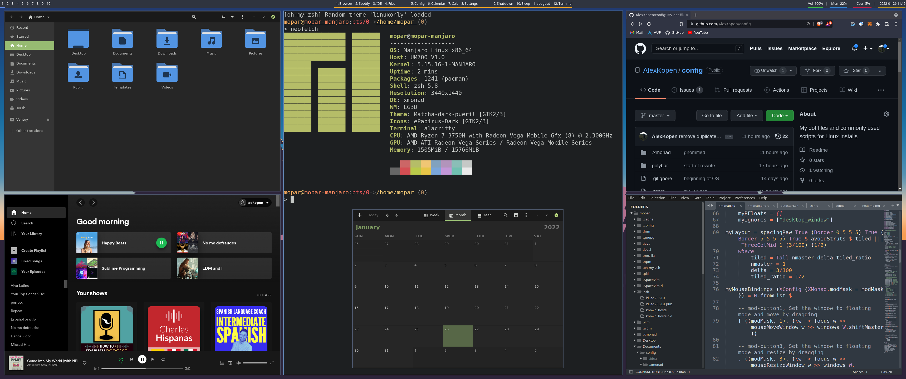

Core
```
sudo pacman -S --needed \
\
base-devel git yay xmonad xmonad-contrib xmonad-utils polybar rofi \
\
alacritty vim ranger zsh go python3 python-pip oh-my-zsh xorg-xkill nitrogen neofetch pamixer playerctl pamac \
\
lxappearance gnome-control-center nautilus gnome-screenshot gnome-calendar gnome-calculator \
gnome-disk-utility guake brave-browser firefox docker docker-compose
```

```
yay -S visual-studio-bin phpstorm phpstorm-jre spotify fnm-bin google-chrome
```

[SpaceVim](https://spacevim.org/)
```
curl -sLf https://spacevim.org/install.sh | bash
```

[Docker](https://docs.docker.com/engine/install/linux-postinstall/#configure-docker-to-start-on-boot)
```
sudo systemctl enable docker.service
sudo systemctl enable containerd.service
```

Git

[SSH](https://docs.github.com/en/authentication/connecting-to-github-with-ssh/generating-a-new-ssh-key-and-adding-it-to-the-ssh-agent)
```
ssh-keygen -t ed25519 -C "alexkopen@gmail.com"
```

```
git config --global user.email "alexkopen@gmail.com" && git config --global user.name "Alex Kopen" && git config --global pull.rebase false
```

[AMD Screen Tearing](https://davejansen.com/quick-how-to-fix-screen-tearing-in-ubuntu-with-amd-gpus/)

Directory: `etc/X11/xorg.conf.d`

File: `20-amdgpu.conf`
```
Section "Device"
        Identifier      "AMD Graphics"
        Driver          "amdgpu"
        Option          "TearFree" "true"
EndSection
```

Validate: `xrandr --verbose | grep "TearFree"`
